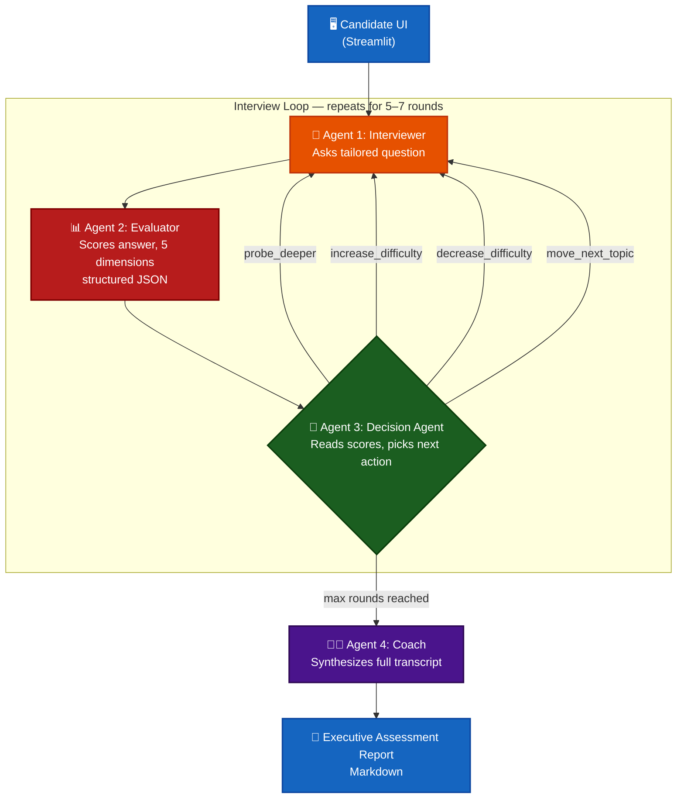
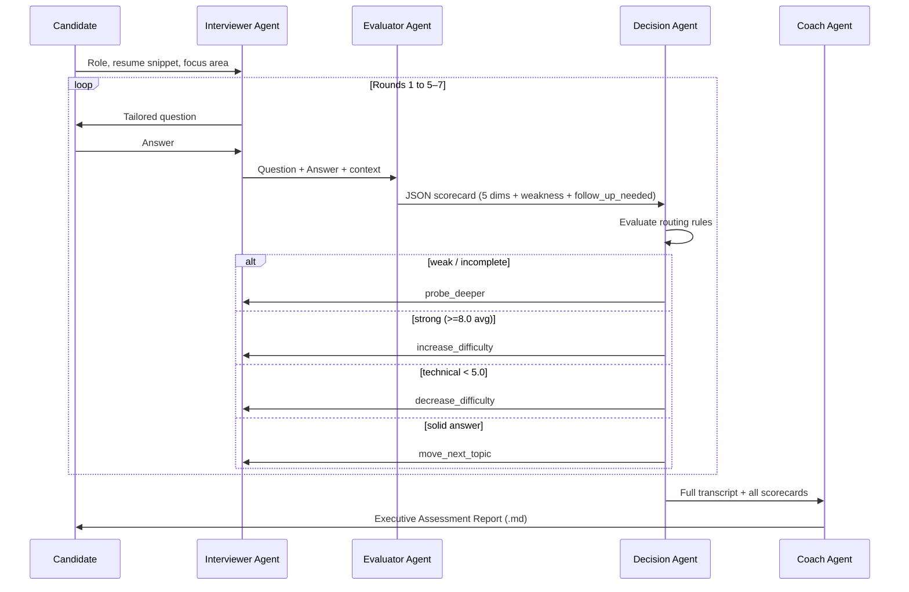

# 🎯 AI Mock Interview Coach

**An adaptive, multi-agent AI system that conducts realistic mock interviews and delivers executive-grade coaching reports.**


**Live:[https://sayani-ai-mock-interview-coach.streamlit.app/](https://sayani-ai-mock-interview-coach.streamlit.app/)**


Built with **LangGraph** · **Streamlit** · **Groq (Llama 3.3 70B)**

[](https://www.python.org/)
[](https://www.langchain.com/langgraph)
[](https://streamlit.io/)
[](https://groq.com/)

> Give it a target role, a resume snippet, and a focus area — it runs a live 5–7 turn interview that probes weak answers, rewards strong ones, and ends with a structured coaching report and a 7-day practice plan.

---

## 📖 Table of Contents

- [Why This Exists](#-why-this-exists)
- [Screenshot](#-screenshot)
- [Architecture Overview](#-architecture-overview)
- [Agent Roles & Responsibilities](#-agent-roles--responsibilities)
- [Orchestration Logic](#-orchestration-logic)
- [Repository Structure](#-repository-structure)
- [Quick Start](#-quick-start)
- [Key Design Decisions & Trade-offs](#-key-design-decisions--trade-offs)
- [Example Interview Transcripts](#-example-interview-transcripts)
- [Assignment Requirements Mapping](#-assignment-requirements-mapping)
- [Roadmap](#-roadmap)

---

## 💡 Why This Exists

Most "mock interview" tools ask a fixed list of questions and grade on vibes. This system instead treats the interview as a **closed control loop**: an evaluator scores every answer across five dimensions, a decision agent reads those scores and decides what happens next (probe deeper, raise the bar, ease off, or move on), and a coach synthesizes the whole transcript into actionable feedback — the same way a real panel debrief works.

---

## 📸 Screenshot


*Live multi-agent interview session — question panel, running scorecard, and agent inspector side by side.*

> Save your screenshot as `assets/frontend-screenshot.png` in the repo root (create the `assets/` folder if it doesn't exist) — this line will then render it automatically on GitHub.

---

## 🏗 Architecture Overview

Four specialized agents are coordinated through a stateful **LangGraph `StateGraph`**, with the Decision Agent acting as the conditional router that keeps the interview looping until a stopping condition is met.



**State flows through a single `InterviewState` object** (see `graph/state.py`) that accumulates the transcript, running scores, current difficulty, and topic history — so every agent has full context without re-fetching anything.

---

## 🤖 Agent Roles & Responsibilities

| # | Agent | File | Persona | Core Function |
|---|-------|------|---------|----------------|
| 1 | **Interviewer** | `agents/interviewer.py` | Professional, empathetic senior technical interviewer | Formulates tailored questions from target role, resume snippet, session focus, and current difficulty. Follows action directives from the Decision Agent (`probe_deeper`, `move_next_topic`, etc.) |
| 2 | **Evaluator** | `agents/evaluator.py` | Strict, objective candidate assessor | Scores each answer 1–10 across **technical, communication, confidence, clarity, depth**. Outputs a validated Pydantic JSON object with scores, identified weakness, and a `follow_up_needed` flag |
| 3 | **Decision Agent** | `agents/decision.py` | Adaptive interview controller | Reads the Evaluator's JSON and routes the graph: probe deeper on weak/incomplete answers, scale difficulty up or down, or advance the topic |
| 4 | **Coach** | `agents/coach.py` | Executive career coach & lead technical reviewer | Synthesizes the full transcript + scorecards into a Markdown **Executive Assessment Report**: overall score, strengths, gaps, communication tips, and a 7-day practice plan |

### Decision Agent routing rules

| Trigger | Directive | Effect |
|---|---|---|
| Technical score `< 6/10` **or** `follow_up_needed = true` | `probe_deeper` | Same topic, deeper sub-question, same difficulty |
| All metrics `≥ 8.0` | `increase_difficulty` | Medium → Hard (or Hard stays Hard, moves topic) |
| Technical score `< 5.0` | `decrease_difficulty` | Drops to Easy, rebuilds foundational confidence |
| Solid, complete answer | `move_next_topic` | Default progression to a new topic area |

---

## 🔄 Orchestration Logic



This is what distinguishes the system from "three prompts in a chain": the **Decision Agent's routing is conditional and stateful** — it changes the Interviewer's next move based on accumulated evidence, not a fixed script.

---

## 📁 Repository Structure

```
ai-interview-coach/
├── agents/
│   ├── __init__.py
│   ├── interviewer.py    # Agent 1 logic
│   ├── evaluator.py      # Agent 2 logic
│   ├── decision.py       # Agent 3 logic
│   └── coach.py          # Agent 4 logic
├── graph/
│   ├── __init__.py
│   ├── state.py          # TypedDict InterviewState definition
│   └── workflow.py       # StateGraph orchestration & conditional routing
├── prompts/
│   ├── interviewer.txt   # External prompt template for Agent 1
│   ├── evaluator.txt     # External prompt template for Agent 2
│   ├── decision.txt      # External prompt template for Agent 3
│   └── coach.txt         # External prompt template for Agent 4
├── .streamlit/
│   └── config.toml       # Streamlit client configuration
├── app.py                # Streamlit UI & Interactive Multi-Agent Inspector
├── config.py              # LLM setup & Groq API key manager
├── requirements.txt       # Project dependencies
└── README.md              # This file
```

---

## 🚀 Quick Start

### 1. Prerequisites
- Python 3.10+
- A free **Groq API key** from [console.groq.com](https://console.groq.com)

### 2. Environment Setup

```bash
# Clone and enter the project
git clone https://github.com/dola2164-png/ai-interview-coach.git
cd ai-interview-coach

# Create & activate a virtual environment
python -m venv .venv

# Windows (PowerShell)
.venv\Scripts\Activate.ps1
# macOS / Linux
source .venv/bin/activate

# Install dependencies
pip install -r requirements.txt
```

### 3. Configure your API key

Create a `.env` file in the project root:

```env
GROQ_API_KEY=gsk_your_free_groq_api_key_here
```

> The key is loaded privately from `.env` via `config.py` and is never rendered in the UI.

### 4. Run it

```bash
streamlit run app.py
```

Then open **http://localhost:8501** and start your session: pick a target role, paste an optional resume snippet, choose a focus area (Behavioral / Technical / Case Study / Mixed), and begin.

---

## 🧠 Key Design Decisions & Trade-offs

| Decision | Why | Trade-off |
|---|---|---|
| **LangGraph `StateGraph`** over a linear chain | Enables true conditional branching (`probe_deeper`, difficulty scaling) driven by evaluator metrics, not a fixed script | More setup complexity than a simple `A → B → C` chain |
| **Groq / Llama 3.3 70B** as the inference engine | Very low latency across multi-agent turns, at no cost — important when a single round triggers 2–3 chained LLM calls | Slightly less nuanced than top-tier closed models on edge-case reasoning |
| **Externalized prompts** (`prompts/*.txt`) | Keeps persona/prompt iteration decoupled from application code; non-engineers could tune tone without touching Python | One extra file read per agent call; requires prompts and Pydantic schemas to stay in sync |
| **Dynamic scoring, no anchor examples** | Removed fixed numeric examples from `evaluator.txt` to prevent the LLM from anchoring on sample scores instead of grading the actual answer | Slightly higher variance in edge-case scoring, mitigated by the strict rubric in the prompt |
| **Structured Pydantic output for the Evaluator** | Guarantees the Decision Agent always receives parseable, schema-valid JSON to route on | Requires retry/validation handling if the LLM emits malformed JSON |

---

## 📝 Example Interview Transcripts

### 1️⃣ Strong Candidate — Frontend Engineer Intern
**Focus:** Mixed · **Rounds:** 3

<details>
<summary><b>Show full transcript</b></summary>

**Round 1 (Medium)**
> **Q:** Can you explain progressive enhancement in web development and how you'd implement it?
> **A:** "Progressive enhancement is a design strategy where we build a basic working core HTML/CSS structure first for all devices/browsers, then add advanced JavaScript capabilities like client-side validation, SPA routing, and dynamic search suggestions for modern browsers."

**Scorecard:** Technical `9` · Communication `9` · Confidence `8` · Clarity `9` · Depth `8`
**Weakness noted:** Could mention fallback strategies or `aria-live` accessibility attributes.
**Directive:** `increase_difficulty` — exceptional architectural clarity, scale up.

**Round 2 (Hard)**
> **Q:** How would you handle state management and performance optimization in a large React app with high-frequency WebSocket updates?
> **A:** "I would decouple high-frequency WebSocket state from the main React render tree using a dedicated store like Zustand or RxJS. To prevent UI jank, I'd batch updates with `requestAnimationFrame` or React 18's `useDeferredValue`, and memoize heavy sub-trees with `React.memo`."

**Scorecard:** Technical `9` · Communication `9` · Confidence `9` · Clarity `9` · Depth `9`
**Directive:** `move_next_topic` — clean coverage of rendering pipeline, batching, decoupling.

**Executive Summary:** **92/100** — Outstanding, Ready for Placement

</details>

### 2️⃣ Weak Candidate — Data Analyst Intern
**Focus:** Technical · **Rounds:** 2

<details>
<summary><b>Show full transcript</b></summary>

**Round 1 (Medium)**
> **Q:** How do you handle missing values in a SQL dataset before running an aggregation query?
> **A:** "I just delete the rows with nulls or use `AVG()`."

**Scorecard:** Technical `4` · Communication `5` · Confidence `5` · Clarity `6` · Depth `3`
**Weakness noted:** No mention of `COALESCE`/`NULLIF`, imputation strategies, or row-deletion vs. aggregate-distortion trade-offs.
**Directive:** `probe_deeper` — technical depth below threshold.

**Round 2 (Medium, probing)**
> **Q:** What specific SQL function would replace NULL values with 0 in a SELECT query?
> **A:** "Maybe `IFNULL` or something? I'm not sure of the exact function name."

**Scorecard:** Technical `4` · Communication `4` · Confidence `3` · Clarity `5` · Depth `2`
**Directive:** `decrease_difficulty` — foundational gap confirmed, drop to Easy.

**Executive Summary:** **45/100** — Needs Foundational Revision in SQL & Data Imputation

</details>

### 3️⃣ Tricky / Edge Case — Product Manager Intern
**Focus:** Case Study · **Rounds:** 2

<details>
<summary><b>Show full transcript</b></summary>

**Round 1 (Medium)**
> **Q:** How would you measure the success of launching a feature like Instagram Stories on a professional network platform?
> **A:** "I don't know much about metrics, maybe I'd just ask users if they like it or check if downloads go up."

**Scorecard:** Technical `3` · Communication `4` · Confidence `3` · Clarity `5` · Depth `2`
**Weakness noted:** Evasive "I don't know" reply, no structured metrics framework (DAU, Retention, Adoption Rate).
**Directive:** `probe_deeper` — simplify the question to test recovery.

**Round 2 (Medium, structured recovery)**
> **Q:** Let's break it down — what's one key engagement action you'd track daily to see if people use the new feature?
> **A:** "Oh! Daily Active Users who post at least one story per day, and the 7-day return retention rate."

**Scorecard:** Technical `8` · Communication `7` · Confidence `7` · Clarity `8` · Depth `7`
**Weakness noted:** Good recovery, but missed guardrail metrics like feed cannibalization.
**Directive:** `move_next_topic` — successful recovery under a structured prompt.

**Executive Summary:** **68/100** — Moderate Potential, Needs Guidance on Initial Framework Structure

</details>

---

## ✅ Assignment Requirements Mapping

| Requirement | Where it's satisfied |
|---|---|
| 3+ distinct agents with genuinely different roles | Interviewer, Evaluator, Decision, Coach — see [Agent Roles](#-agent-roles--responsibilities) |
| Orchestration logic shown, not a disguised chain | `graph/workflow.py` — conditional `StateGraph` routing, see [sequence diagram](#-orchestration-logic) |
| 5–7 turn interview with intelligent follow-ups | Decision Agent's `probe_deeper` / `move_next_topic` logic |
| Adaptive difficulty calibration | `increase_difficulty` / `decrease_difficulty` routing rules |
| Multi-dimensional evaluation (not good/bad) | 5-dimension Evaluator scorecard, structured JSON |
| Structured outputs (JSON / Markdown) | Pydantic JSON from Evaluator, Markdown report from Coach |
| Handles vague / off-topic / "I don't know" answers | See Transcript 3 — probe-and-recover flow |
| CLI or UI interface | Streamlit app (`app.py`) with a live multi-agent inspector |
| `requirements.txt` | Included at repo root |
| `prompts/` folder, one file per agent | `prompts/interviewer.txt`, `evaluator.txt`, `decision.txt`, `coach.txt` |
| README: setup, architecture, design decisions, 3 transcripts | This file |

---

## 🛣 Roadmap

- [ ] Optional RAG grounding with role-specific question banks
- [ ] Difficulty-aware question bank fallback for API rate limits
- [ ] Exportable PDF version of the Executive Assessment Report
- [ ] Multi-role batch mode for practicing several target roles in one session

---


---

<p align="center">Built as part of an AI Engineer internship assignment — designing agents that argue, not just agents that answer.</p>
